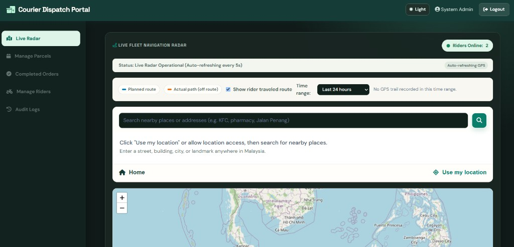
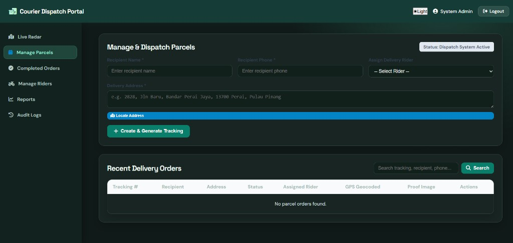
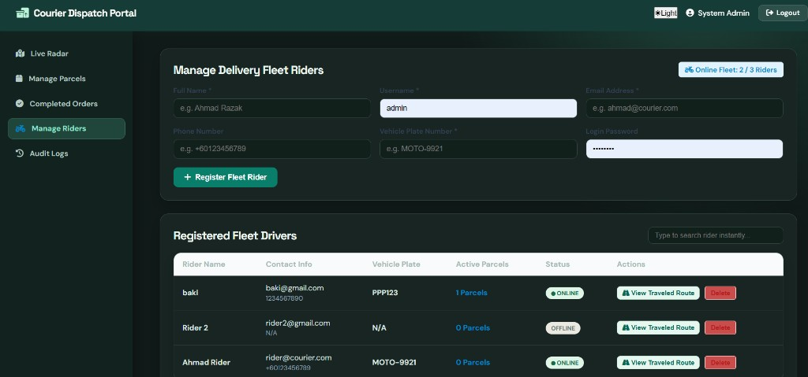
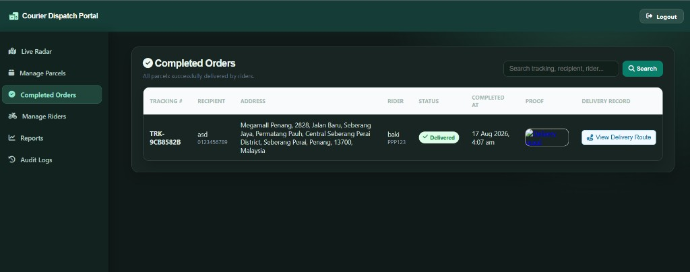
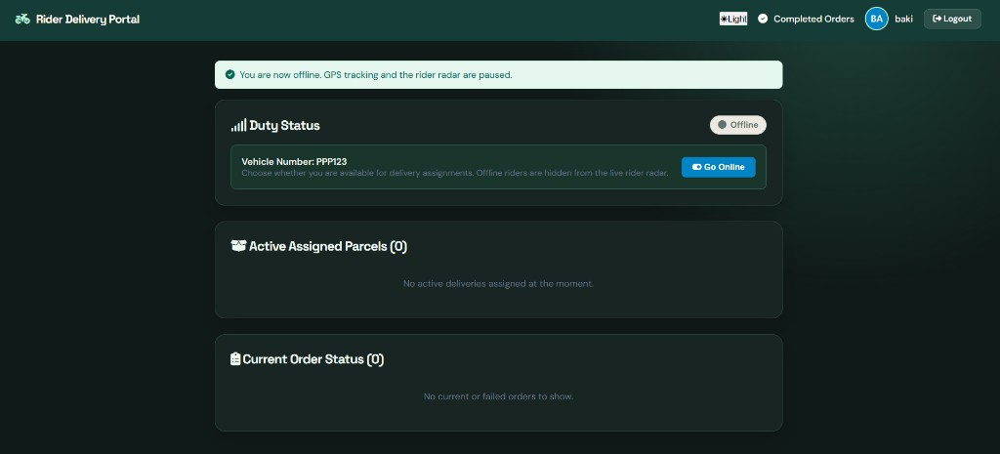
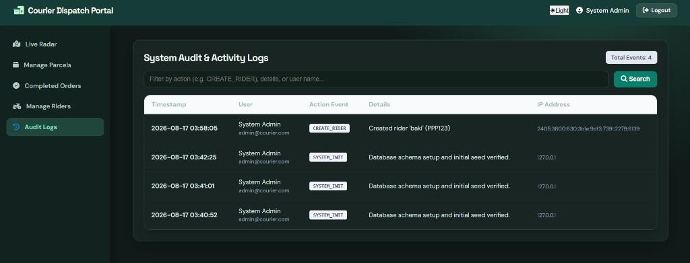

# ParcelTrack Pro

PHP + MySQL courier dispatch portal for **educational use**. Admins assign parcels and watch the live fleet; riders update duty status, GPS, and delivery proof from their own portal.


-0B6E4F)


## Screenshots

<p align="center">
  
  
</p>
<p align="center">
  
  
</p>
<p align="center">
  
  
</p>

| Left | Right |
| --- | --- |
| Live fleet radar with planned vs actual GPS trails | Create parcels, geocode addresses, assign riders |
| Register riders and view traveled routes | Completed orders with proof photos |
| Rider duty status and assigned parcels | System audit / activity logs |

## Features

- **Admin dispatch** — create parcels, geocode delivery addresses, assign riders, search and filter orders
- **Live radar** — online riders on a map, planned route vs actual GPS trail
- **Rider portal** — go online/offline, update parcel status, upload delivery proof
- **Route planner** — multi-stop routes for assigned parcels
- **Completed orders** — proof images and delivery route playback
- **Reports & audit logs** — date-range summaries and staff activity history
- **Role-based auth** — admin and rider sessions with CSRF protection

## Tech stack

- PHP 8 (PDO / MySQL)
- Vanilla JavaScript
- Leaflet maps
- HTML / CSS (admin + rider themes)

## Quick start

1. Clone this repository into your web root (XAMPP `htdocs`, Laragon `www`, etc.).
2. Copy the example database config and edit **your** values only:

   ```bash
   copy config\db.example.php config\db.php
   ```

   Replace `your_database_name`, `your_db_user`, and `your_db_password`.  
   `config/db.php` is gitignored — never commit real hosting credentials, cron keys, or recovery keys.

3. Create an empty MySQL database that matches `DB_NAME` in `config/db.php`.
4. Open `setup.php` once on localhost to create tables and first accounts.  
   It prints **one-time** passwords — change them immediately in Profile. Do not reuse them on cPanel.
5. Sign in at `/login.php`, then delete or rename `setup.php`.

Hosting notes use placeholders only:

- `docs/CPANEL.example.md`
- `docs/UPLOAD.example.md`
- Cron example: `cron.php?key=YOUR_CRON_SECRET`

## Project layout

```
admin/          Dispatcher UI (radar, parcels, riders, reports, logs)
rider/          Rider UI (duty status, parcels, routes, history)
api/            JSON endpoints (GPS, status, uploads, geocoding)
config/         db.example.php / config.example.php  →  copy locally (not committed)
database/       schema.sql (tables only, no real data)
assets/         CSS, JS, and upload folders
includes/       Auth, header/footer, helpers
```

## License

This project is released under the [MIT License](LICENSE) **for educational purposes**.
Use it to learn, demo, or extend a courier workflow — not as production hosting credentials.
